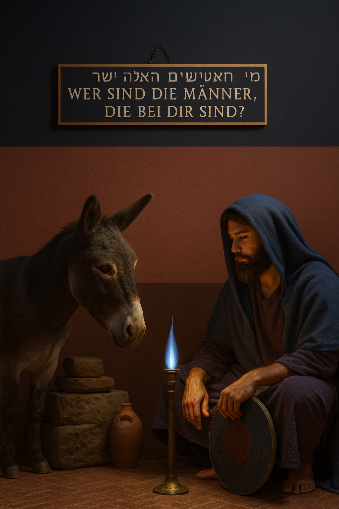

# Bileam - Lehrling des Wortes

## Klappentext
Du spielst Bileam, den Zauberlehrling mit einer sprechenden Eselin an der Seite. König Balak von Moab hat ein Problem: Das Volk Israel ist eingewandert, seine Felder verwüstet, und er will es mit Fluchworten vertreiben. Doch hebräische Worte sind hier Schöpfungscode – und אלוהים lässt nicht zu, dass sein Volk verflucht wird. Gibst du `aor`, bricht Licht durch Lehmhütten; sprichst du `mayim`, bewegen sich Flüsse. Deine Eselin mahnt mit Humor, Engel aus gebündeltem Licht prüfen dich, und Balak versucht unablässig, deine Sprache zu missbrauchen.

Die Story spiegelt alte Spannungen und klingt in heutige Konflikte hinein (auch Gaza): Sprache als Macht, als Schutz und als Versuchung. Spielerisch streift das Spiel Informationstheorie, Simulationshypothese und die Idee, dass Worte den Bauplan der Welt formen.

Jedes Level ist ein kleines Lehrdrama. Die Szene oben zeigt Level 7: Fürsten, Bannfahnen und Weinbergmauern bilden die Bühne, während die Eselin dreimal `shama` einfordert, bevor sie das Unsichtbare preisgibt. Mal entzündest du Altäre mit `ash`, mal stoppst du Balaks Gesandte mit `lo`, mal lässt du mit `baruch` Segen wie Lapislazuli über Basaltfliesen laufen. Dialoge klingen wie biblische Poesie, doch sie erklären klar, welches Wort du begreifen, tippen und behalten musst.

*Bileam – Lehrling des Wortes* verbindet Storytelling mit Lernmechanik: du hörst, sprichst, tippst und siehst sofort, wie Licht, Wasser oder Stein auf deine Lippen reagieren. Das Ancient-Futurism-Artwork, die ruhige Musik und die didaktische Eselin machen jeden Abschnitt zum spirituell-poetischen Sprachtraining.

## Was dich erwartet
- **Poetische Atmosphäre:** Archaische Dialoge, ruhige Musik, Ancient-Futurism-Optik zwischen Wüstensand und schimmernden Glyphen.
- **Lernen durch Erleben:** Du tippst oder sprichst hebräische Worte (ohne Niqqud) und siehst, wie Licht, Wasser, Stein und Leben sofort reagieren.
- **Didaktischer Zyklus:** Erinnern, Begreifen, Anwenden – jedes Level ist eine kleine Lektion, die auf dem Vorherigen aufbaut.
- **Dynamische Begleitung:** Die Eselin führt didaktisch, Balak drängt, Engel lehren – du navigierst zwischen Versuchung, Wahrheit und Gehorsam.

## Figuren, die dich prägen
- **Bileam:** Ein neugieriger Lehrling, dessen Staunen jede neue Lektion trägt.
- **Die Eselin:** Dein geduldiger Begleiter mit klaren, kurzen Hinweisen.
- **König Balak:** Machtbesessen, glänzend und immer bereit, Sprache zu missbrauchen.
- **Engel:** Wesen aus Licht, die spätere Levels bewachen und lehren.

## So probierst du das Spiel aus
- gehe auf https://launix.de/bileam/
- Folge den Hinweisen der Eselin, sprich oder tippe die Wörter und beobachte, wie die Welt darauf reagiert.

